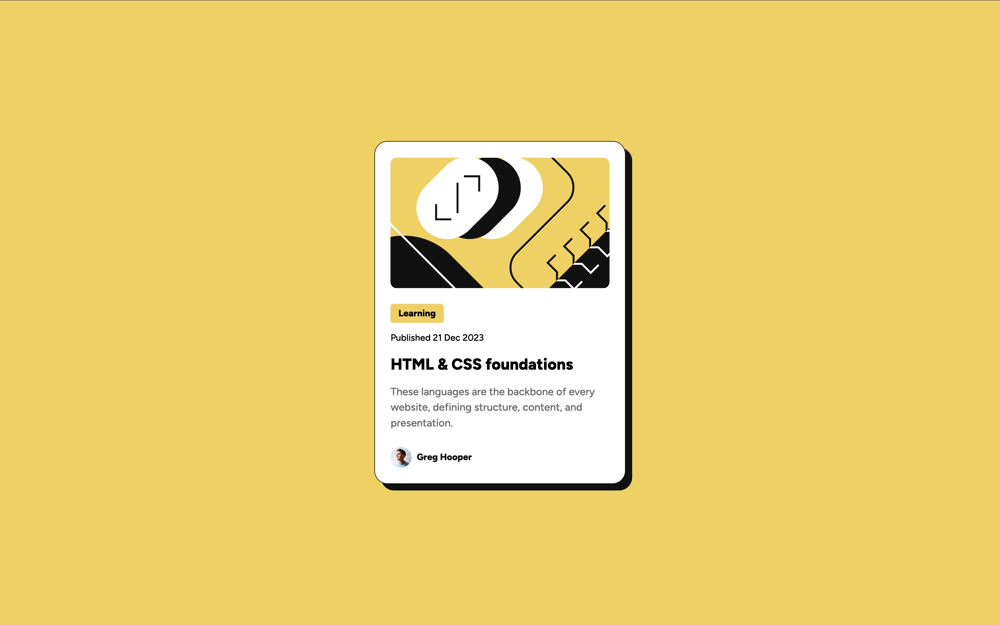
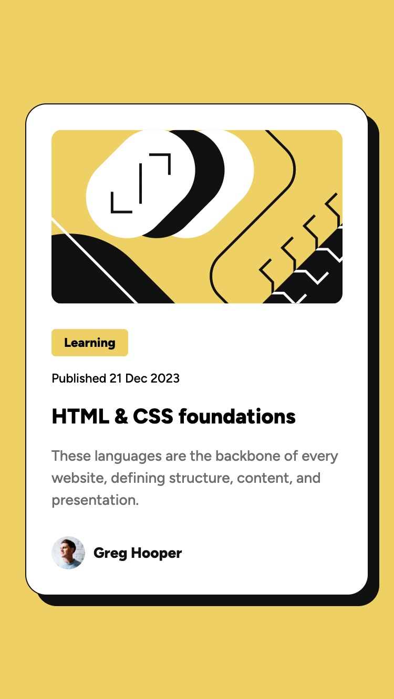

# blog-preview-card

This is a solution to the Blog preview card challenge on Frontend Mentor.

## Overview

### Screenshot

| Desktop | Mobile |
|---------|--------|
|  |  |

## Built with

- Semantic HTML5 markup
- CSS custom properties
- Flexbox
- CSS Grid
- Responsive design with relative units

### What I learned

In this project, I learned how to effectively use responsive design techniques:

**Responsive sizing with `width` and `max-width`:**

```css
.blog-container {
    width: 384px; /* Desired fixed width for larger screens */
    max-width: 90%; /* Ensures element shrinks on smaller screens */
}
```
